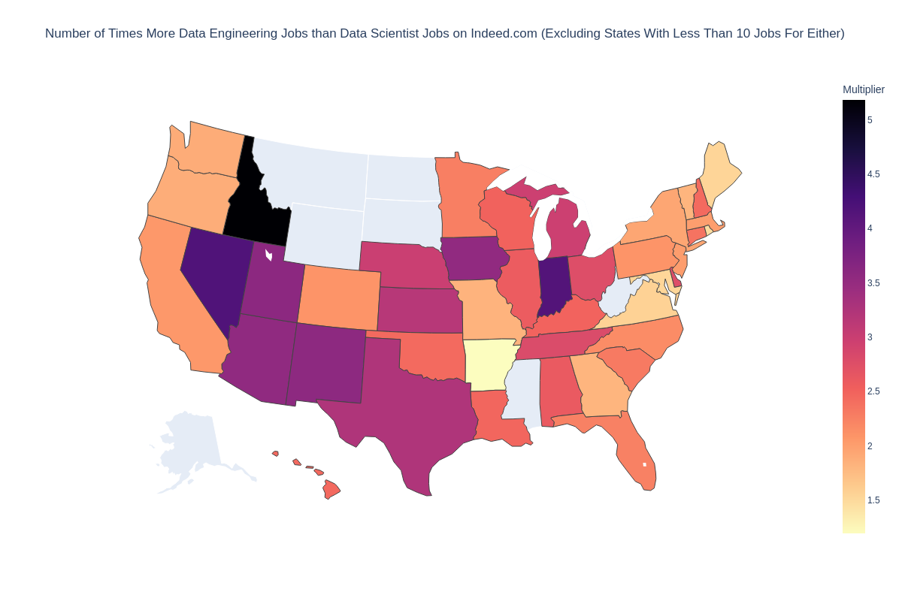

# A Rudimentary Analysis of Data Scientist and Data Engineering Vacancies on Indeed.com

## Introduction

Inspired by an article titled [We Don't Need Data Scientists, We Need Data Engineers](https://www.mihaileric.com/posts/we-need-data-engineers-not-data-scientists/), I decided to run a quick and dirty analysis on the number of jobs that appear in each US state for the titles "Data Scientist" and "Data Engineer" on Indeed.com.

Based on my takeaways from the article, my hypothesis was that there would be more data engineering jobs than data scientist jobs across a majority of the states.

## Data Extraction Methodology

The Jupyter Notebook titled `0. indeed-data-extraction.ipynb` is the scraping script that I used to programmatically search for each job title in every state and obtain the total number of results returned.

Here's how it works:

* I filled in the "What" field with either `title:(data engineer)` or `title:(data scientist)`. This returns a list of vacancies with the respective search terms in the title of the job ad.
* I filled in the "Where" field with the name of a state and repeated the title searches for each of the 50 US states.
* On each search results page, I scraped the number of results returned. They're returned in the form of, for example, "Page 1 of 580 jobs" and appears right above the listing of job ads.

The scrape was run on the 19th of January 2022. All data displayed below was extracted on this date.

## Findings

The Jupyter Notebook titled `1.analysis-and-visualization.ipynb` contains the scraped data displayed in both tabular form as well as in interactive choropleth maps.

As you can clearly see from the tables and maps below, there are more "Data Engineer" jobs than "Data Scientist" jobs across all 50 states.

### Overall Results

|US State        |Data Engineer Vacancies|Data Scientist Vacancies|More Engineers|
|----------------|-----------------------|------------------------|--------------|
|Alabama         |81                     |31                      |True          |
|Alaska          |17                     |1                       |True          |
|Arizona         |334                    |94                      |True          |
|Arkansas        |61                     |51                      |True          |
|California      |3342                   |1620                    |True          |
|Colorado        |252                    |120                     |True          |
|Connecticut     |242                    |102                     |True          |
|Delaware        |72                     |26                      |True          |
|Florida         |606                    |269                     |True          |
|Georgia         |535                    |295                     |True          |
|Hawaii          |54                     |22                      |True          |
|Idaho           |57                     |11                      |True          |
|Illinois        |967                    |374                     |True          |
|Indiana         |187                    |45                      |True          |
|Iowa            |85                     |24                      |True          |
|Kansas          |89                     |28                      |True          |
|Kentucky        |45                     |18                      |True          |
|Louisiana       |47                     |19                      |True          |
|Maine           |37                     |24                      |True          |
|Maryland        |509                    |332                     |True          |
|Massachusetts   |1034                   |514                     |True          |
|Michigan        |342                    |115                     |True          |
|Minnesota       |272                    |120                     |True          |
|Mississippi     |23                     |6                       |True          |
|Missouri        |233                    |127                     |True          |
|Montana         |47                     |9                       |True          |
|Nebraska        |75                     |25                      |True          |
|Nevada          |71                     |17                      |True          |
|New Hampshire   |44                     |18                      |True          |
|New Jersey      |544                    |269                     |True          |
|New Mexico      |68                     |19                      |True          |
|New York State  |1409                   |723                     |True          |
|North Carolina  |548                    |253                     |True          |
|North Dakota    |19                     |4                       |True          |
|Ohio            |512                    |185                     |True          |
|Oklahoma        |44                     |18                      |True          |
|Oregon          |226                    |120                     |True          |
|Pennsylvania    |600                    |286                     |True          |
|Rhode Island    |46                     |31                      |True          |
|South Carolina  |60                     |26                      |True          |
|South Dakota    |25                     |2                       |True          |
|Tennessee       |244                    |87                      |True          |
|Texas           |2063                   |634                     |True          |
|Utah            |187                    |52                      |True          |
|Vermont         |20                     |11                      |True          |
|Virginia        |1071                   |683                     |True          |
|Washington State|1130                   |596                     |True          |
|West Virginia   |23                     |3                       |True          |
|Wisconsin       |173                    |69                      |True          |
|Wyoming         |20                     |3                       |True          |

### Number of Times More Engineer Vacancies than Scientist Vacancies

_This is best viewed in a locally running version of the Jupyter Notebook file as it is an interactive chart._

This chart excludes states with less than 10 jobs for each search term as it skews the higher end of the color scale towards smaller states with stark differences due to their low job vacancy numbers (e.g. Alaska or North Dakota).

## Caveats

There are several caveats to this analysis as it is rudimentary:

1. In my opinion, the terms "data engineer" and "data scientist" are still loosely defined. Depending on the company, a data scientist may be expected to perform some ETL and a data engineer may be expected to use machine learning APIs. You'd have to delve into the job descriptions of each ad to determine which ones are "pure" roles and which are more "hybrid".
2. I excluded the title "data analyst" from this analysis as it is far more loosely defined than the other two. While some data analysts could be data scientists, I've seen the term used by people who create and maintain dashboards, run SQL queries, and run analyses on nothing but Excel.
3. There may be other titles that fall under the general title of "data scientist" that I did not account for such as "machine learning engineer" or "NLP engineer".
4. It's entirely possible that jobs outside of the state entered into the "Where" field were displayed in the search results as well. Therefore these would've been factored into the state totals in the results above.